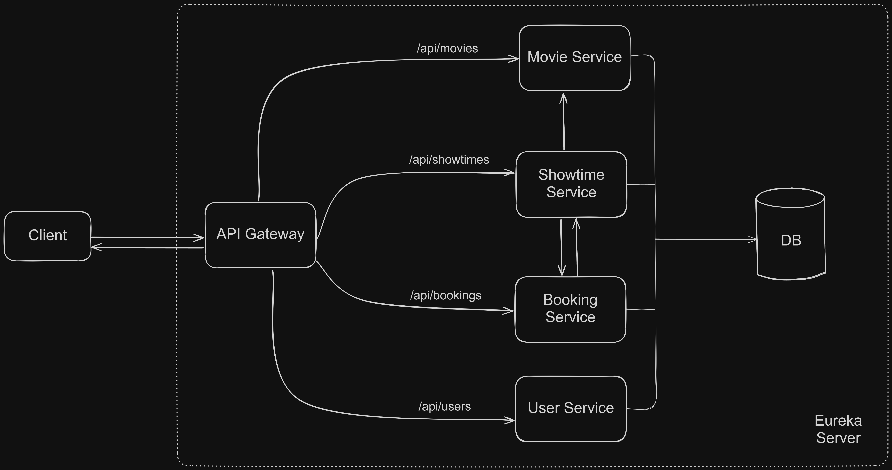

## 📽️ Movie Ticketing Microservice

This project is a microservice-based architecture for a movie ticket booking application. It provides secure and modular services to manage movies, showtimes, and ticket bookings. Each service is designed for scalability and flexibility.

### 🪶 Features

- JWT authentication for user verification.
- Role-based access control for managing `ADMIN` and `USER` permissions.
- Centralized API Gateway for routing and inter-service communication.
- Services are loosely coupled and scalable independently.
- Centralized exception handling across all services.

### 🧑‍💻 Technology Used

- Java 17
- Spring Boot
- Spring Security
- Eureka Service Discovery
- Feign Client (service to service communication)
- MySQL (Database)

### Services Overview

| **Service**          | **Description**                                                                      |
| -------------------- | ------------------------------------------------------------------------------------ |
| **User Service**     | Manages user authentication, registration, and role-based access.                    |
| **API Gateway**      | Serves as the central entry point, routing requests to the respective microservices. |
| **Movie Service**    | Manages movie details, including fetching, adding, updating, and deleting movies.    |
| **Showtime Service** | Handles scheduling and seat availability for movie showtimes.                        |
| **Booking Service**  | Manages ticket booking operations and retrieves user-specific booking details.       |

### Architectural Flow



### ⚙️ Local Setup

- Clone the repository:

```bash
git clone https://github.com/aviralj02/movie-ticketing-microservice
cd movie-ticketing-microservice
```

- Update the database configurations in each service's `application.properties` file.
- Import the folder as a Maven project.
- Run Services: Start _Eureka Discovery Server_ first and then others.
- All routes can be accessed through the API Gateway at `http://localhost:9090/`

### API Docs

#### 1. User Service

- `POST /api/user/register`: Register a new user.
- `POST /api/user/login`: Authenticate and get JWT token.

#### 2. Movie Service

- `GET /api/movies`: Retrieve all movies.
- `GET /api/movies/{id}`: Retrieve a specific movie by ID.
- Admin Routes:
  - `POST /api/movies/admin`: Add a new movie.
  - `PUT /api/movies/admin/{id}`: Update a movie.
  - `DELETE /api/movies/admin/{id}`: Delete a movie.

#### 3. Showtime Service

- `GET /api/showtimes`: Retrieve all showtimes.
- `GET /api/showtimes/{id}`: Retrieve a specific showtime by ID.
- Admin Routes:
  - `POST /api/showtimes/admin`: Add a new show.

#### 4. Booking Service

- `POST /api/bookings`: Book a ticket.
- `GET /api/bookings/{userId}`: Retrieve all bookings for a user.
- `GET /api/bookings?showtimeId=`: Retrieve all bookings for a show.
